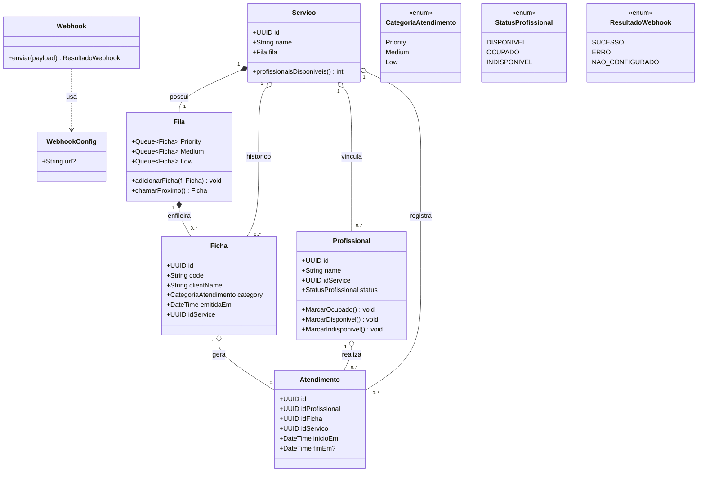

## Diagrama de classe

draw.io: https://app.diagrams.net/#G1UR5ViAbHcCuxr4jYljAVzmnJzwghlo9q#%7B%22pageId%22%3A%22SPg6ARsj7m4EUYAmXlnh%22%7D



## Classes

- Serviço
- Fila
- Ficha
- Profissional
- Atendimento
- Webhook
- WebhookConfig

## 1. Serviço

Gerencia sua fila de fichas, profissionais vinculados e a operação de chamar o próximo cliente.

Atributos

- id: UUID
- name: String
- profissionais: List<Profissional>
- Fila fila

Metodos

- ProfissionaisDisponiveis(): int

Regras de Negócio associadas

- Um serviço possui exatamente 1 fila prioritária.
- As fichas emitidas para um serviço entram apenas na fila daquele serviço.
- O atendimento respeita prioridade: Priority → Medium → Low (sem furar), e FIFO dentro da mesma categoria.
- O profissional só pode chamar próximo cliente do serviço ao qual está vinculado.

## 2. Fila

Representa a estrutura que mantém as fichas em ordem de prioridade.

Atributos

- Priority: Queue<Ficha>
- Medium: Queue<Ficha>
- Low: Queue<Ficha>

Metodos

- adicionarFicha(f: Ficha) - Adiciona a ficha na fila correspondente à categoria.
- chamarProximo(): Ficha - Retorna e remove a próxima ficha respeitando:
  - se Priority não vazia → retorna dela
  - senão se Medium não vazia → retorna dela
  - senão se Low não vazia → retorna dela
  - se todas vazias → “sem ficha” (erro / nil / vazio)
- temClientes(): bool  

## 3. Ficha

Representa a solicitação de atendimento feita por um cliente.

Atributos

- id: UUID
- clientName: String
- category: CategoriaAtendimento (Priority, Medium, Low)
- emitidaEm: DateTime (Momento de emissão)
- idService: UUID (Serviço ao qual a ficha pertence)

metodo
- chamadaEm: DateTime

Regras

- Cada ficha sempre pertence a um único serviço.
- Uma ficha pode gerar no máximo um atendimento.
- Ao ser chamada, a ficha é removida da fila.

## 4. Profissional

Representa o atendente que chama fichas e realiza os atendimentos.

Atributos

- id: UUID
- name: String
- idService: UUID (Serviço ao qual está vinculado)
- status: StatusProfissional (DISPONIVEL | OCUPADO | INDISPONIVEL)

Metodos

- MarcarOcupado() - Marcar profissional como OCUPADO
- MarcarDisponivel() - Marcar profissional como DISPONIVEL
- MarcarIndisponivel() - Marcar profissional como INDISPONIVEL

Regras

- Um profissional pode existir sem serviço vinculado (idService = null).
- Status inicial recomendado ao cadastrar: INDISPONIVEL.
- Só pode chamar próximo cliente se estiver DISPONIVEL e vinculado a um serviço.
- Se estiver OCUPADO, deve encerrar o atendimento antes de chamar outro.
- Se estiver INDISPONIVEL, não pode chamar próximo nem encerrar atendimento.
- Só atua no serviço ao qual está vinculado.
- Só pode alterar idService (vincular/trocar serviço) se estiver INDISPONIVEL.

## 5. Atendimento

Representa o registro oficial de um atendimento realizado.

Atributos

- id: UUID (Identificador do atendimento)
- idProfissional: UUID (Profissional que realizou a chamada)
- idFicha: UUID (Ficha atendida)
- idServico: UUID (Serviço onde ocorreu)
- inicioEm: DateTime (Início da chamada)
- fimEm: DateTime (Fim da chamada)

Regras

- UUm profissional pode ter no máximo 1 atendimento em aberto por vez.
- Uma ficha deve gerar, no máximo, 1 atendimento.

## 6. Webhook

atributos

- status: StatusWebhook (SUCESSO | ERRO | NAO_CONFIGURADO)

metodos

- enviar(payload): void
  - tenta enviar HTTP para a URL configurada
  - se falhar, registra log e não bloqueia a criação do atendimento

## 7. WebhookConfig

Atributos

- url: string

## Enums

## CategoriaAtendimento

- Priority
- Medium
- Low

## StatusProfissional

- DISPONIVEL
- OCUPADO
- INDISPONIVEL

## Relacionamentos

### Serviço — Fila

Cada serviço possui exatamente 1 fila
Servico 1 —— 1 Fila

### Serviço — Ficha

Um serviço possui muitas fichas (histórico / emitidas)
Servico 1 —— 0..\* Ficha

### Serviço — Profissional

Um serviço pode ter muitos profissionais vinculados
Um profissional pode estar vinculado a 0 ou 1 serviço (até vincular)
Servico 1 —— 0..*\* Profissional

### Profissional — Atendimento

Um profissional pode realizar muitos atendimentos
Profissional 1 —— 0..\* Atendimento

### Ficha — Atendimento

Uma ficha gera no máximo 1 atendimento
Ficha 1 —— 0..1 Atendimento

### Serviço — Atendimento

Um serviço registra muitos atendimentos
Servico 1 —— 0..\* Atendimento

### Webhook — WebhookConfig

O webhook usa a configuração para obter a URL
Webhook ..> WebhookConfig

```

```
