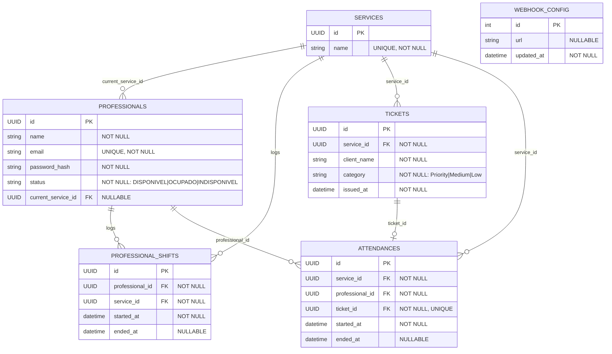

## Diagrama Entidade-Relacionamento (ER)

Se eu fosse salvar isso num banco de dados, quais seriam as tabelas, quais colunas elas teriam e como elas se relacionam?

entidade vira tabela
atibutos vira colunas
relacionamentos vira chaves estrangeiras(FK)

PK (Primary Key): identificador único da tabela
FK (Foreign Key): campo que aponta para outra tabela

### Tabelas

#### services

- id (PK, UUID)
- name (UNIQUE, NOT NULL)

#### profissionais
Representa o profissional cadastrado e seu estado atual no sistema.

- id (PK, UUID)
- name (NOT NULL)
- email (UNIQUE, NOT NULL)
- password_hash (NOT NULL)
- service_id (FK → services.id, NULLABLE)
- status (NOT NULL — DISPONIVEL | OCUPADO | INDISPONIVEL)

#### professional_activity (histórico de expediente / atuação)
Registra quando o profissional iniciou e encerrou expediente em um serviço (histórico).

- id (PK, UUID)
- professional_id (FK → professionals.id, NOT NULL)
- service_id (FK → services.id, NOT NULL)
- started_at (NOT NULL)
- ended_at (NULLABLE)

#### ticket
Fila (em memória) vira persistência de fichas emitidas + histórico.

- id (PK, UUID)
- service_id (FK → services.id, NOT NULL)
- client_name (NOT NULL)
- category (NOT NULL — Priority | Medium | Low)
- issued_at (NOT NULL)

#### atendimentos

- id (PK, UUID)
- service_id (FK → services.id, NOT NULL)
- professional_id (FK → professionals.id, NOT NULL)
- ticket_id (FK → tickets.id, NOT NULL, UNIQUE)
- started_at (NOT NULL)
- ended_at (NULLABLE)

#### webhook_config

- id (PK, int)
- url (NULLABLE)
- updated_at (NOT NULL)

Relacionamentos
services 1 — N profissionais
services 1 — N tickets
services 1 — N atendimentos
profissionais 1 — N atendimentos
fichas 1 — 0..1 atendimentos

