## Diagrama de sequência

draw.io: https://app.diagrams.net/#G1UR5ViAbHcCuxr4jYljAVzmnJzwghlo9q#%7B%22pageId%22%3A%22ZbWJfetMCKG_KI7-XJCB%22%7D

### Diagrama de sequência - Chamar proximo Cliente()

### O que este diagrama mostra

A sequência completa de mensagens entre **ator → API → camada de aplicação → entidades → webhook**, incluindo os principais pontos de decisão.

### Participantes e papel

- Ator: dispara a ação.
- API/Controller: valida request básica e delega.
- AtendimentoService: coordena o fluxo (orquestra as chamadas).
- ProfissionalRepo: recupera o profissional e seu status (profissional existe mesmo sem serviço vinculado).
- Servico: valida vínculo do profissional com o serviço (ex.: profissional.idService == servico.id) e dá acesso à fila.
- Fila: aplica regra de prioridade (Priority → Medium → Low + FIFO).
- Webhook/WebhookConfig: tenta notificar sistema externo.

### Entrada e saída

- Entrada mínima: `idServico`, `idProfissional`
- Saída de sucesso: dados do atendimento criado
- Erros que interrompem o fluxo: serviço inexistente, profissional inválido/não autorizado, profissional não disponível, fila vazia, falha ao criar atendimento
- Erros que não interrompem: falha no webhook / URL não configurada (apenas log)

### Pontos de decisão (alts)

1. Serviço existe?
2. Profissional existe?
3. Profissional está vinculado ao serviço?
4. Profissional está DISPONIVEL?
5. Fila tem ficha?
6. Webhook tem URL configurada?
7. Chamada do webhook foi bem sucedida?

### Decisões de modelagem

- O webhook: falhar webhook não deve bloquear o atendimento.
- A escolha da ficha acontece dentro da Fila (Priority → Medium → Low).
- Controle de concorrência é responsabilidade da implementação.
- A validação de vínculo do profissional é feita pelo idService do profissional (ele pode existir com idService = null até se vincular).

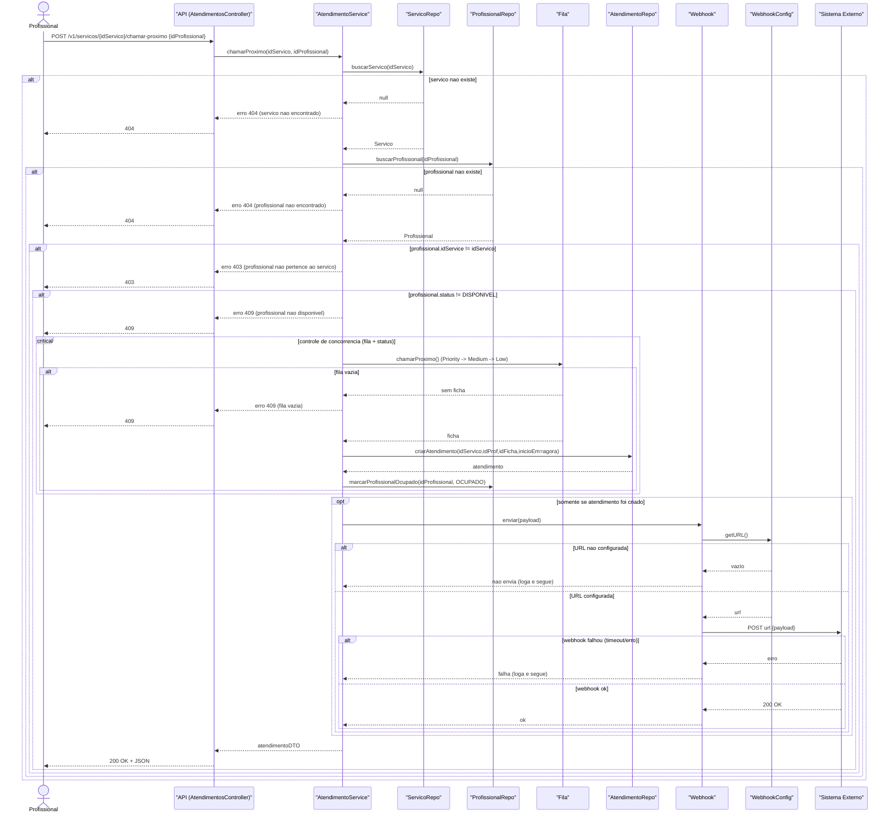

### Diagrama de sequência - Encerrar Atendimento()

### O que este diagrama mostra

O encerramento de um atendimento em andamento, registrando `fimEm` e liberando o profissional (`DISPONIVEL`), com validações principais usando `alt`.

### Participantes e papel

- Ator: solicita encerramento.
- API/Controller: recebe e delega.
- AtendimentoService: coordena validações e atualização.
- ProfissionalRepo: busca profissional e status.
- ServicoRepo/Servico: valida que o serviço existe e que o vínculo do profissional é com aquele serviço.
- AtendimentoRepo: localiza e atualiza o atendimento em aberto.

### Entrada e saída

- Entrada mínima: `idServico`, `idProfissional`
- Saída de sucesso: confirmação (200 OK) e/ou atendimento atualizado
- Erros que interrompem: serviço inexistente, profissional não autorizado, profissional não OCUPADO, atendimento em aberto não encontrado, erro interno

### Pontos de decisão (alts)

1. Serviço existe?
2. Profissional existe?
3. Profissional pertence ao serviço?
4. Profissional está OCUPADO?
5. Existe atendimento em aberto para encerrar?

### Decisões de modelagem

- Encerrar atendimento não consulta fila.
- Se status for OCUPADO mas não existir atendimento em aberto, isso é tratado como inconsistência (erro + log).

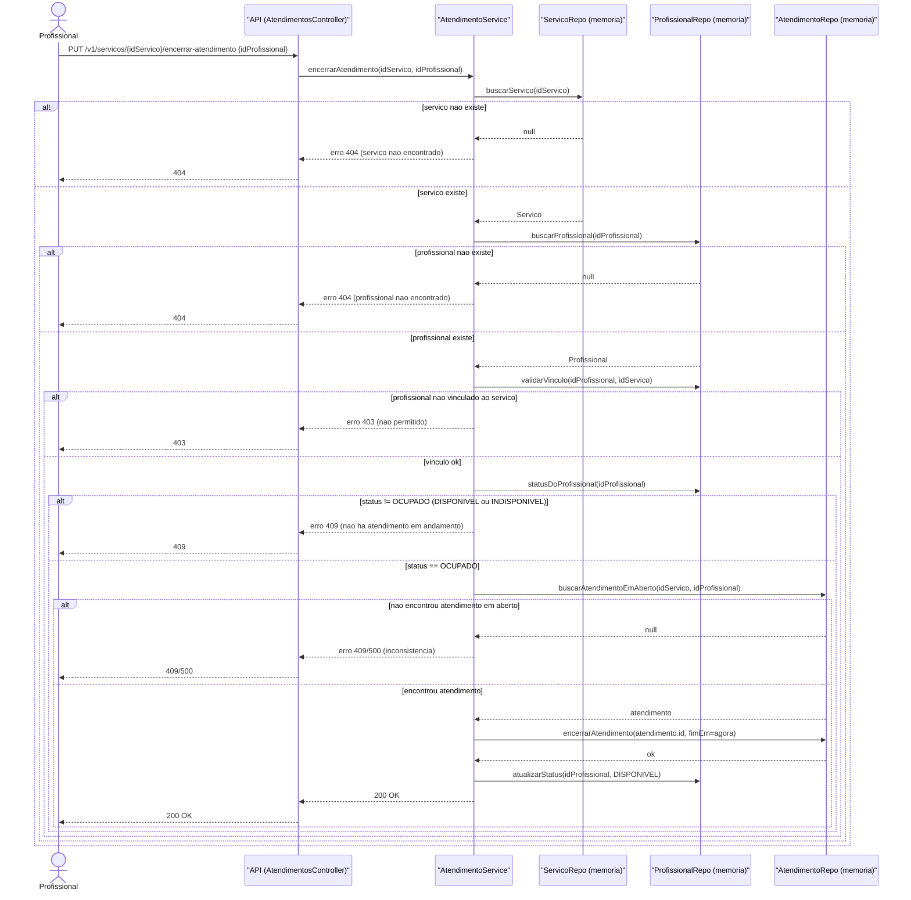

### Diagrama de sequência - Emitir Ficha()

#### O que este diagrama mostra

A emissão de uma ficha por um cliente, com validação de entrada e inclusão da ficha na fila correta (Priority/Medium/Low).

#### Participantes e papel

- Ator: solicita emissão.
- API/Controller: recebe requisição e delega.
- FichaService: coordena validações e criação da ficha.
- FichaService: cria a ficha (gera id, data, idService).
- ServicoRepo/Servico: garante que o serviço existe e dá acesso à fila do serviço.
- Fila: adiciona a ficha na fila correta.

#### Entrada e saída

- Entrada mínima: `idServico`, `nomeCliente`, `categoria`
- Saída de sucesso: ficha criada
- Erros que interrompem: nome inválido, categoria inválida, serviço inexistente, erro interno ao manipular fila/memória

#### Pontos de decisão (alts)

1. Nome do cliente é válido?
2. Categoria é válida?
3. Serviço existe?

#### Decisões de modelagem

- A ficha pode ser emitida mesmo que não exista profissional disponível (pode retornar aviso informativo).
- A escolha da fila (Priority/Medium/Low) é responsabilidade da `Fila.adicionarFicha()`.

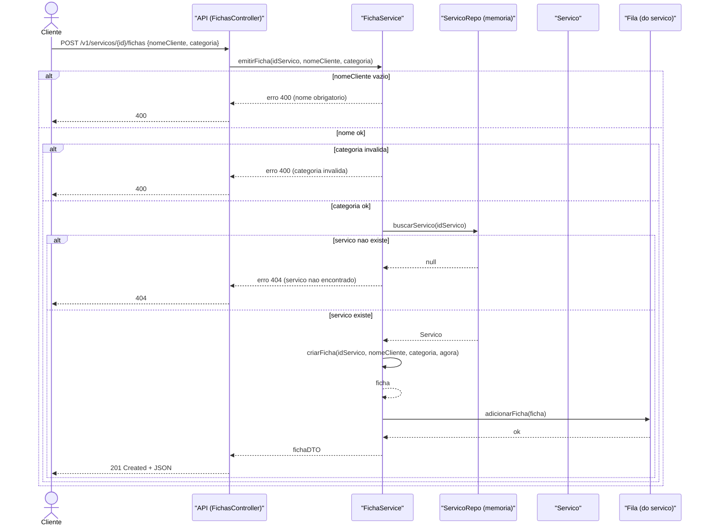

## Diagrama de sequência — Cadastrar Profissional()

#### O que este diagrama mostra

O cadastro de um profissional no sistema, com validação do nome e persistência em memória.

#### Participantes e papel

- Ator: solicita o cadastro.
- API/Controller: recebe a requisição e delega.
- ProfissionalService: valida regras e coordena a criação.
- ProfissionalRepo: salva o profissional criado.

#### Entrada e saída

- Entrada mínima: nome, email, password
- Saída de sucesso: profissional criado (201)
- Erros que interrompem: nome inválido, email inválido, senha obrigatória não informada, email já cadastrado, falha interna ao salvar

#### Pontos de decisão (alts)

1. Nome é válido?
2. Email é válido?
3. Senha foi informada?
4. Email já cadastrado?

#### Decisões de modelagem

- Profissional é criado com:
    - status = INDISPONIVEL
    - idService = null
- Email é o identificador único do profissional.
- A senha recebida é transformada internamente em passwordHash. 

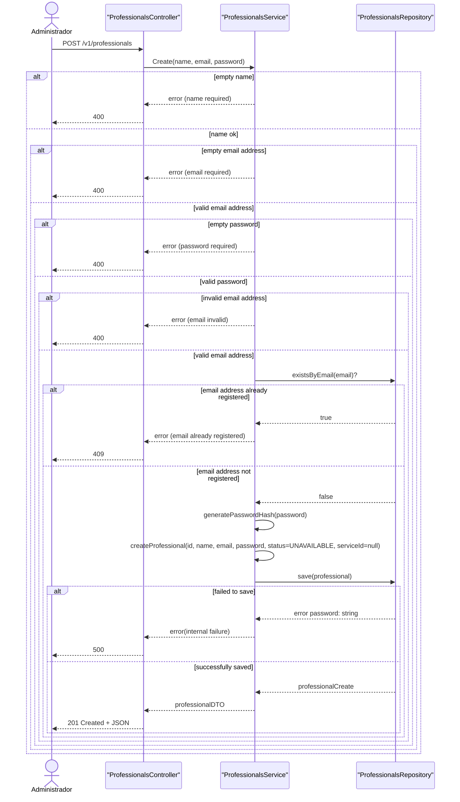

## Diagrama de sequência — Vincular Profissional a um Serviço()

#### O que este diagrama mostra

O fluxo onde o profissional seleciona um serviço disponível para atuar, registrando o vínculo (profissional.idService = servico.id).

#### Participantes e papel

- Ator: solicita o vínculo.
- API/Controller: recebe e delega.
- ProfissionalService: coordena validações e atualização do vínculo.
- ProfissionalRepo: busca e atualiza o profissional.
- ServicoRepo: valida que o serviço existe.

#### Entrada e saída

- Entrada mínima: idProfissional, idServico
- Saída de sucesso: confirmação (200 OK) e/ou profissional atualizado
- Erros que interrompem: profissional inexistente, serviço inexistente, profissional OCUPADO, erro interno ao atualizar

#### Pontos de decisão (alts)

1. Profissional existe?
2. Serviço existe?
3. Profissional está OCUPADO?

### Decisões de modelagem

- Se o profissional estiver OCUPADO, não pode trocar de serviço.
- Se profissional.idService já estiver preenchido → bloquear (409).

```mermaid

sequenceDiagram
    actor Prof as Profissional
    participant API as "API (ProfissionaisController)"
    participant SVC as "ProfissionalService"
    participant PRepo as "ProfissionalRepo (memoria)"
    participant SRepo as "ServicoRepo (memoria)"

    Prof->>API: PUT /v1/profissionais/{idProf}/vincular-servico {idServico}
    API->>SVC: vincularServico(idProfissional, idServico)

    SVC->>PRepo: buscarProfissional(idProfissional)
    alt profissional nao existe
        PRepo-->>SVC: null
        SVC-->>API: erro 404 (profissional nao encontrado)
        API-->>Prof: 404
    else profissional existe
        PRepo-->>SVC: Profissional

        alt status == OCUPADO
            SVC-->>API: erro 409 (profissional em atendimento)
            API-->>Prof: 409
        else status == DISPONIVEL
            SVC-->>API: erro 409 (encerre expediente antes de vincular/trocar servico)
            API-->>Prof: 409
        else status == INDISPONIVEL

            alt profissional ja possui servico vinculado (idService != null)
                SVC-->>API: erro 409 (profissional ja vinculado&#59; encerre expediente para trocar)
                API-->>Prof: 409
            else sem servico vinculado (idService == null)

                SVC->>SRepo: buscarServico(idServico)
                alt servico nao existe
                    SRepo-->>SVC: null
                    SVC-->>API: erro 404 (servico nao encontrado)
                    API-->>Prof: 404
                else servico existe
                    SRepo-->>SVC: Servico

                    SVC->>PRepo: atualizarServicoDoProfissional(idProfissional, idServico)
                    alt falha ao atualizar
                        PRepo-->>SVC: erro
                        SVC-->>API: erro 500 (falha interna)
                        API-->>Prof: 500
                    else atualizado com sucesso
                        PRepo-->>SVC: ProfissionalAtualizado
                        SVC-->>API: 200 OK (profissional atualizado)
                        API-->>Prof: 200 OK + JSON
                    end
                end
            end
        end
    end
```

## Diagrama de sequência — Iniciar Expediente()

#### O que este diagrama mostra

O fluxo para um profissional iniciar o expediente, mudando seu status para DISPONIVEL, após validar: serviço existe, profissional existe, vínculo com o serviço e status atual (não pode estar OCUPADO).

#### Participantes e papel

- Ator (Profissional): solicita iniciar expediente.
- API/Controller (ProfissionaisController): recebe a requisição e delega para a camada de aplicação.
- ProfissionalService: orquestra as validações e a mudança de status.
- ServicoRepo: busca o serviço.
- ProfissionalRepo: busca e atualiza o profissional.

#### Entrada e saída

- Entrada mínima: idServico, idProfissional
- Saída de sucesso: 200 OK (profissional com status=DISPONIVEL)
- Erros que interrompem:
  - serviço inexistente (404)
  - serviço inexistente (404)
  - profissional inexistente (404)
  - profissional não vinculado ao serviço (403)
  - profissional OCUPADO (409)
  - falha interna ao atualizar (500)

#### Pontos de decisão (alts)

1. Serviço existe?
2. Profissional existe?
3. Profissional está vinculado ao serviço?
4. Profissional está OCUPADO?
5. Atualização do status ocorreu com sucesso?

## Decisões de modelagem

- Iniciar expediente não cria atendimento, apenas muda status para DISPONIVEL.
- A validação de vínculo é feita comparando prof.idService com idServico.
- O status OCUPADO bloqueia a operação (não faz sentido iniciar expediente “em atendimento”).

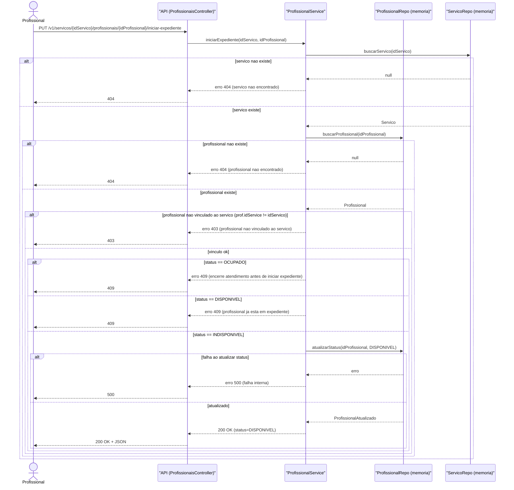

## Diagrama de sequência — Encerrar Expediente()

#### O que este diagrama mostra

O fluxo para um profissional encerrar o expediente, mudando seu status para INDISPONIVEL, com validações de:

- serviço existe
- profissional existe e está vinculado ao serviço
- profissional não pode estar OCUPADO
- Fila está vazia?
- Regra: não pode encerrar expediente se a fila do serviço não estiver vazia

#### Participantes e papel

- Ator (Profissional): solicita encerrar expediente.
- API/Controller (ProfissionaisController): recebe a requisição e delega.
- ProfissionalService: orquestra validações + aplicação das regras.
- ServicoRepo: busca o serviço.
- ProfissionalRepo: busca e atualiza o profissional.
- Servico / Fila: usados para checar “último disponível” e “fila vazia”.

#### Entrada e saída

- Entrada mínima: idServico, idProfissional
- Saída de sucesso: 200 OK (status=INDISPONIVEL)
- Erros que interrompem:
  - 404 serviço inexistente
  - 404 profissional inexistente
  - 403 profissional não vinculado
  - 409 profissional OCUPADO
  - 409 “último DISPONIVEL com fila não vazia”
  - 500 falha interna ao atualizar

#### Pontos de decisão (alts)

1 Serviço existe?
2 Profissional existe?
3 Profissional pertence ao serviço?
4 Profissional está OCUPADO?
5 Profissional é o último DISPONIVEL?
6 Fila tem clientes?
7 Atualização de status ok?

#### Decisões de modelagem

- A checagem de “último disponível” pode ser implementada como:
  - Servico.contarDisponiveis() e comparar com 1, ou
  - Servico.eUltimoDisponivel(idProfissional).

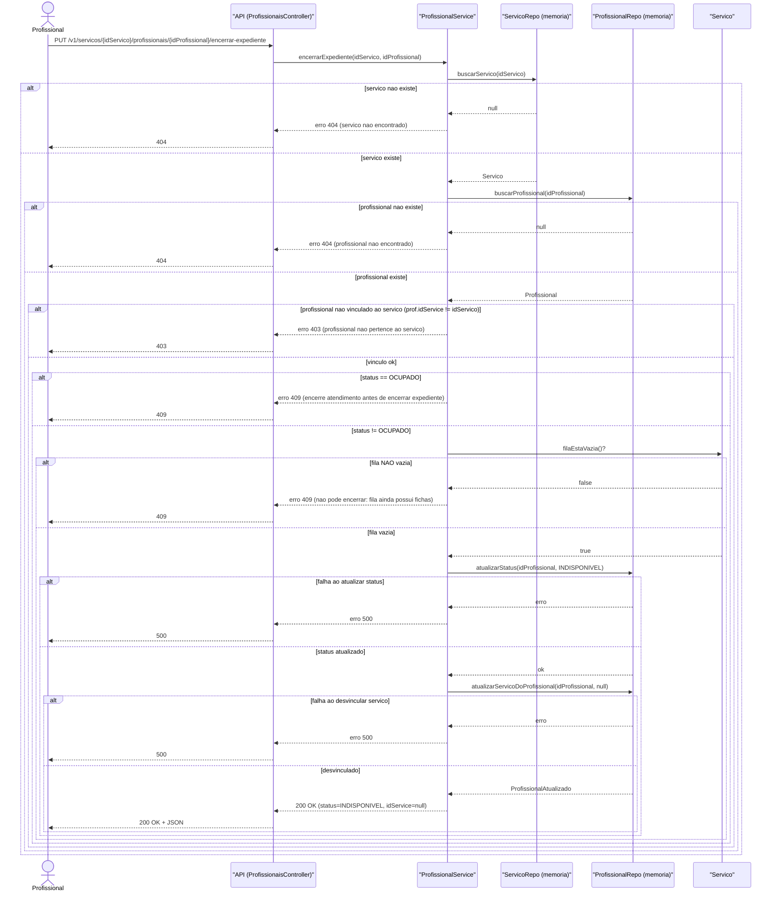

### Diagrama de sequência - Listar Serviços()

#### O que este diagrama mostra

A leitura da lista de serviços cadastrados em memória e o retorno para o ator.

#### Participantes e papel

- **Ator**: solicita listagem.
- **API/Controller**: recebe requisição e delega.
- **ServicoService**: coordena a busca.
- **ServicoRepo**: retorna a lista em memória.

#### Entrada e saída

- **Entrada mínima**: nenhuma
- **Saída de sucesso**: lista de serviços (`200`) — pode ser vazia
- **Erros que interrompem**: erro interno ao recuperar dados / timeout

#### Pontos de decisão (alts)

1. Falha interna ao recuperar lista?

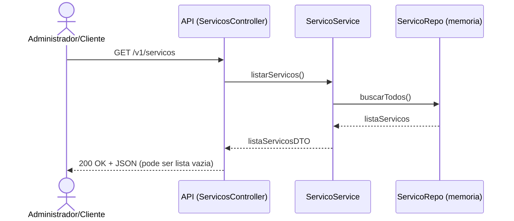

### Diagrama de sequência - Criar Serviço()

#### O que este diagrama mostra

A criação de um novo serviço com validação do nome e verificação de duplicidade, persistindo em memória.

#### Participantes e papel

- **Ator**: solicita criação.
- **API/Controller**: recebe requisição e delega.
- **ServicoService**: valida e coordena.
- **ServicoRepo**: checa duplicidade e salva o novo serviço.

#### Entrada e saída

- **Entrada mínima**: `nome`
- **Saída de sucesso**: serviço criado (`201`)
- **Erros que interrompem**: nome inválido, serviço duplicado, erro interno ao salvar

#### Pontos de decisão (alts)

1. Nome é válido?
2. Serviço já existe?

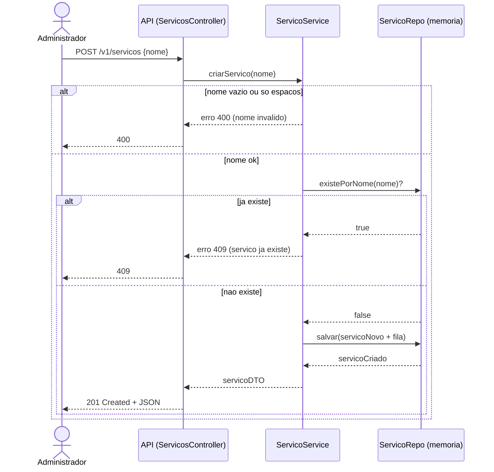

### Diagrama de sequência - Configurar Webhook()

#### O que este diagrama mostra

A atualização da URL de webhook utilizada pelo sistema para envio de notificações.

#### Participantes e papel

- **Ator**: solicita configuração.
- **API/Controller**: recebe requisição e delega.
- **WebhookConfigService**: valida e coordena.
- **WebhookConfigRepo**: salva/atualiza a URL em memória.

#### Entrada e saída

- **Entrada mínima**: `url`
- **Saída de sucesso**: confirmação (`200`)
- **Erros que interrompem**: url inválida, erro interno ao salvar

#### Pontos de decisão (alts)

1. URL é válida?

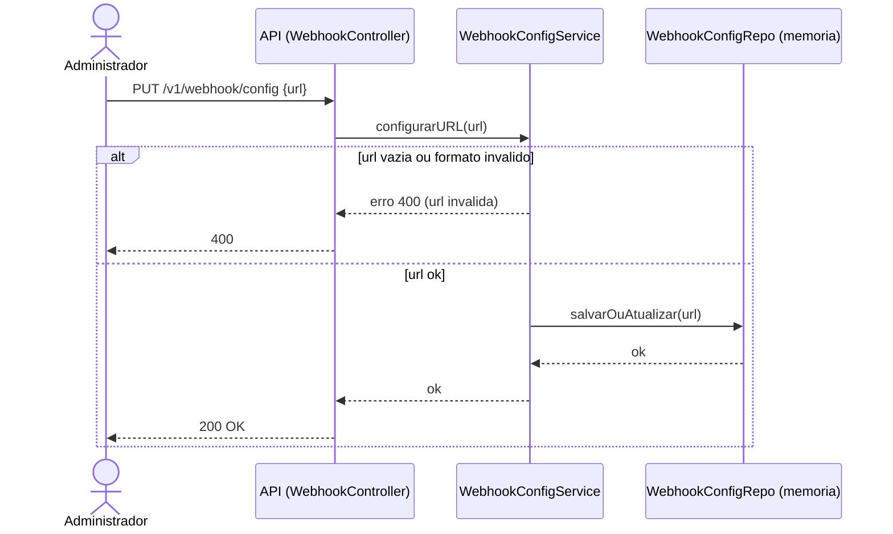

### Diagrama de sequência - Enviar Webhook()

#### O que este diagrama mostra

O envio de webhook como ação interna: busca de URL configurada e tentativa de POST, registrando falhas sem quebrar o fluxo chamador.

#### Participantes e papel

- **Caller**: componente que solicita o envio (ex.: caso de uso).
- **Webhook**: prepara e tenta enviar.
- **WebhookConfigRepo**: fornece a URL configurada.
- **Sistema Externo**: recebe a requisição (quando possível).

#### Entrada e saída

- **Entrada mínima**: `payload`
- **Saída**: resultado da tentativa (ok/falha) + logs
- **Erros que não interrompem**: url não configurada, falha de rede/timeout, resposta inválida

#### Pontos de decisão (alts)

1. URL está configurada?
2. POST foi bem sucedido?

#### Decisões de modelagem

- Webhook é best-effort: falhas não devem quebrar o fluxo principal chamador.

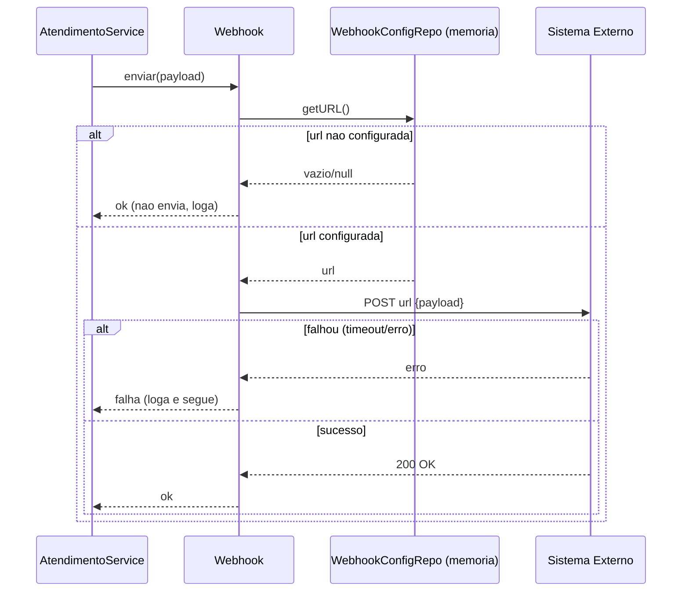
