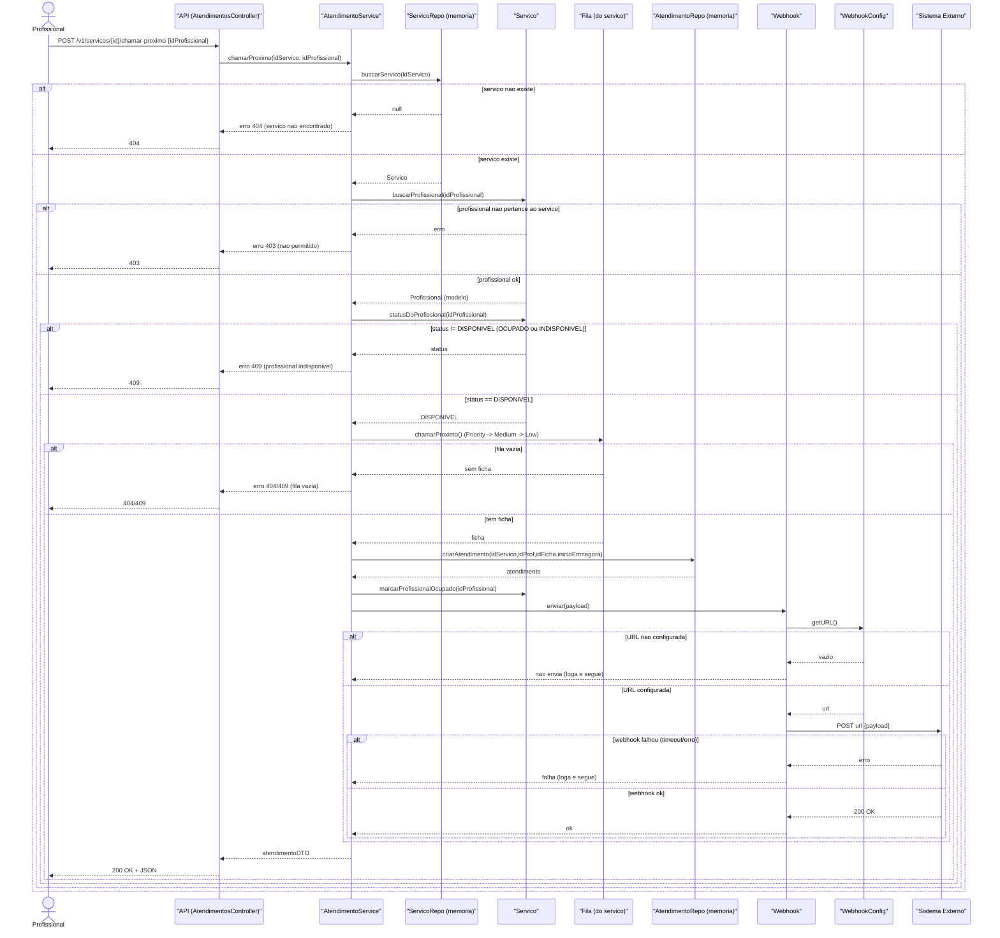
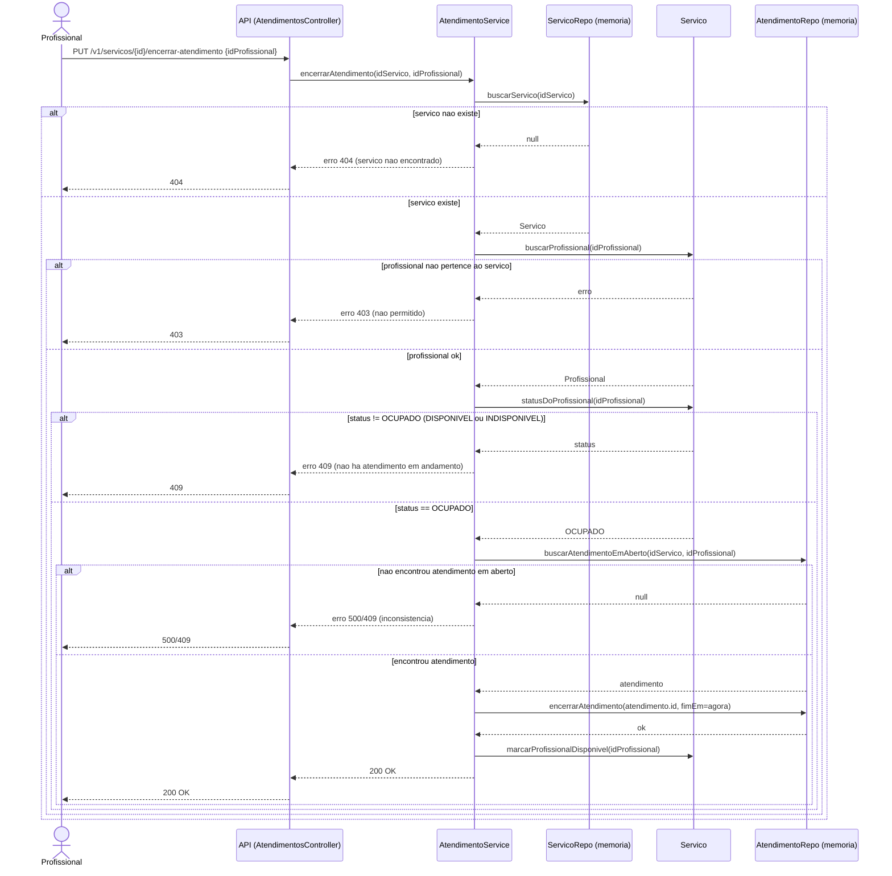
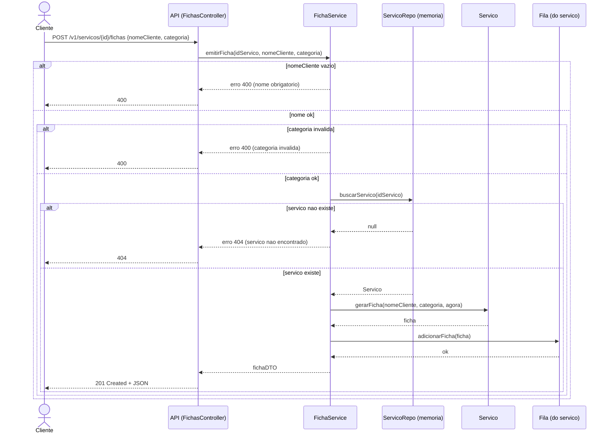
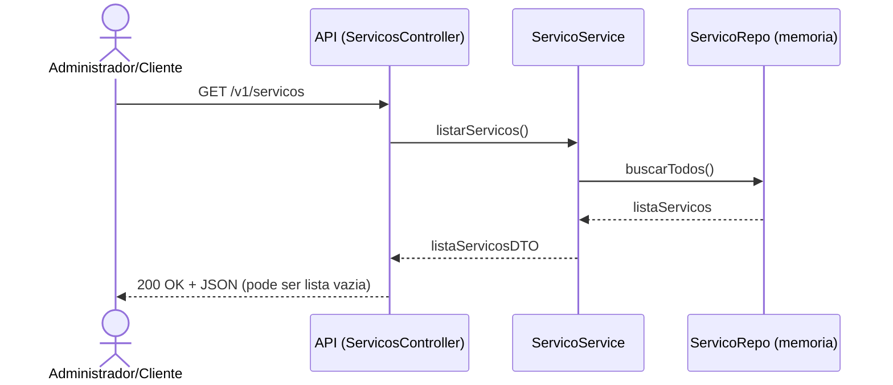
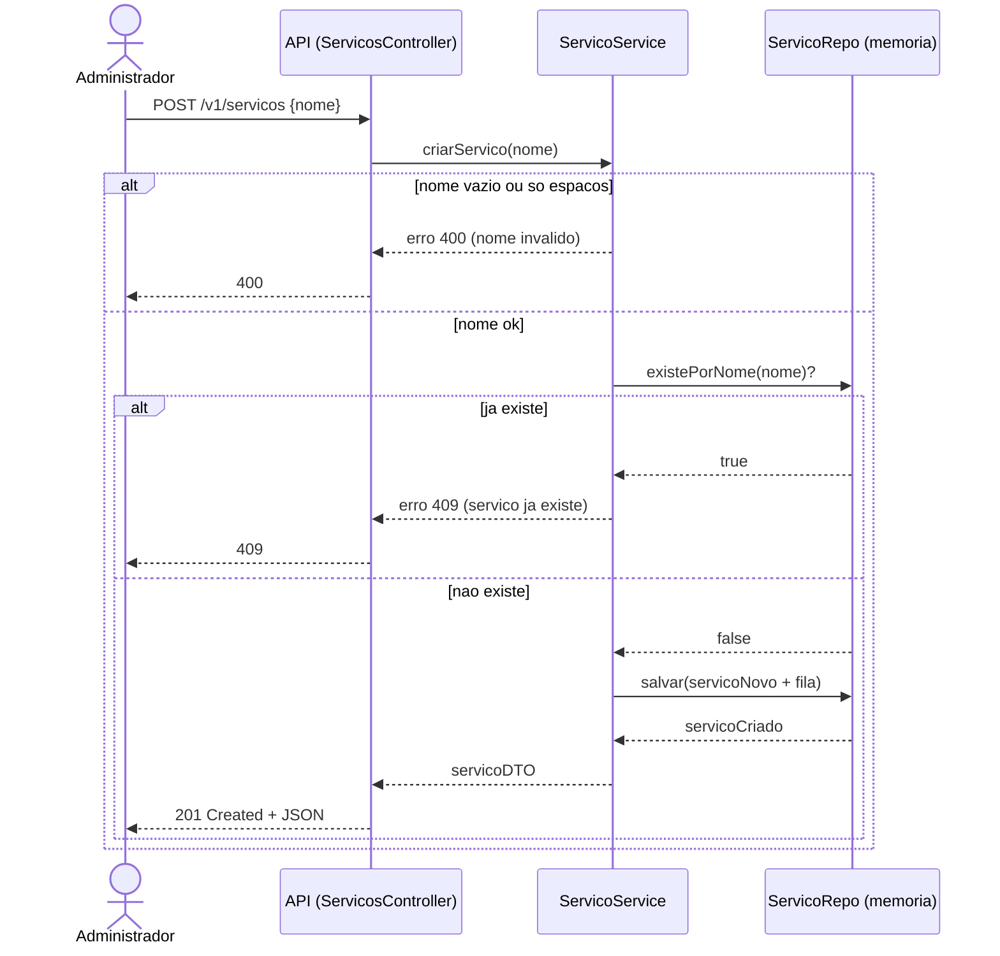
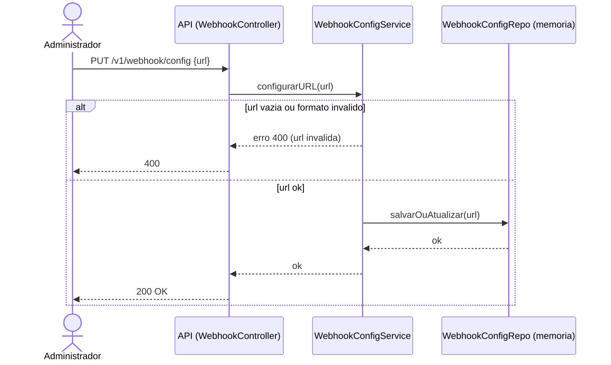
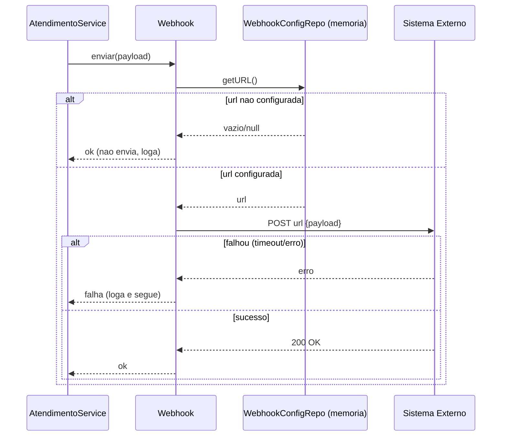

## Diagrama de sequencia

draw.io: https://app.diagrams.net/#G1UR5ViAbHcCuxr4jYljAVzmnJzwghlo9q#%7B%22pageId%22%3A%22ZbWJfetMCKG_KI7-XJCB%22%7D

### Diagrama de sequencia - Chamar proximo Cliente()

### Diagrama de sequencia - Encerrar Atendimento()

### Diagrama de sequencia - Emitir Ficha()

### Diagrama de sequencia - Listar Servicos()

### Diagrama de sequencia - Criar Servico()

### Diagrama de sequencia - Configurar Webhook()

### Diagrama de sequencia - Enviar Webhook()

