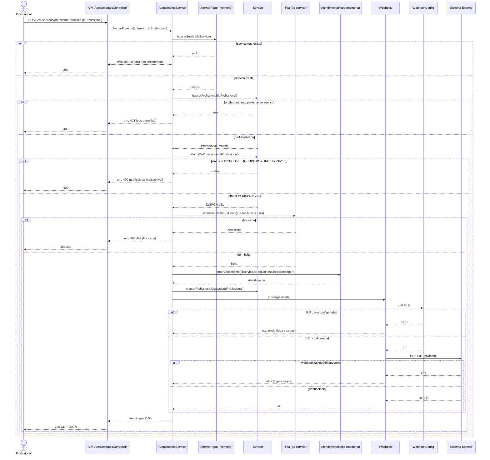
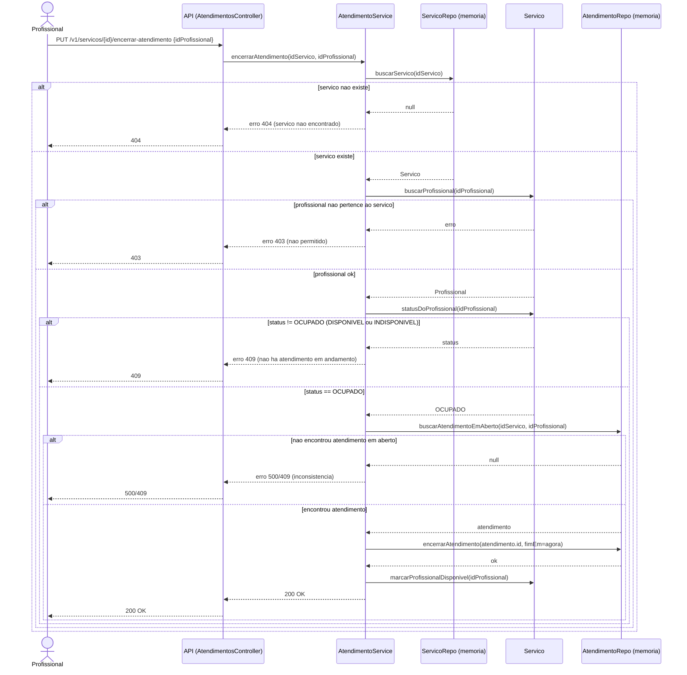
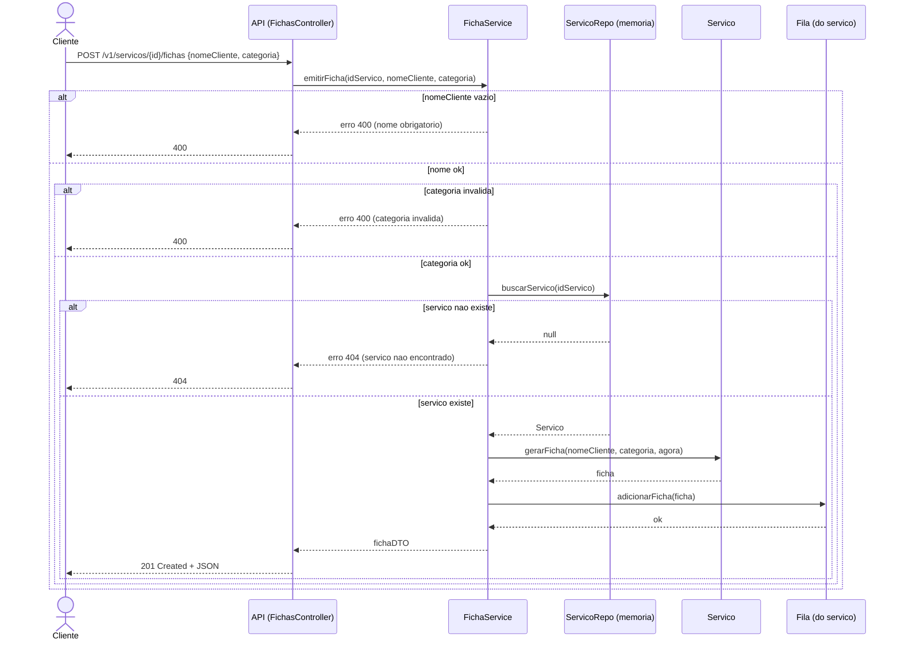
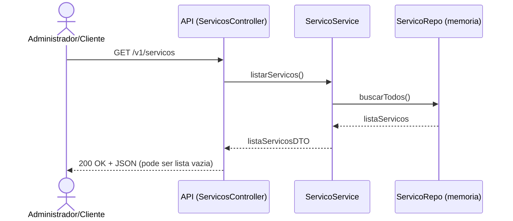
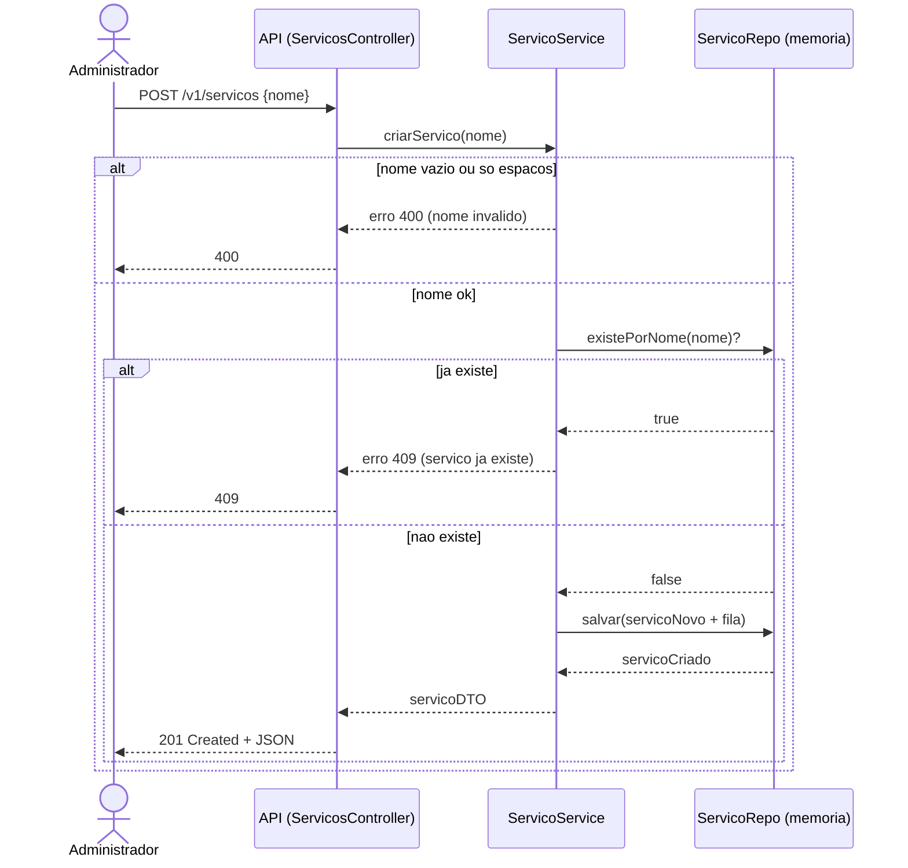
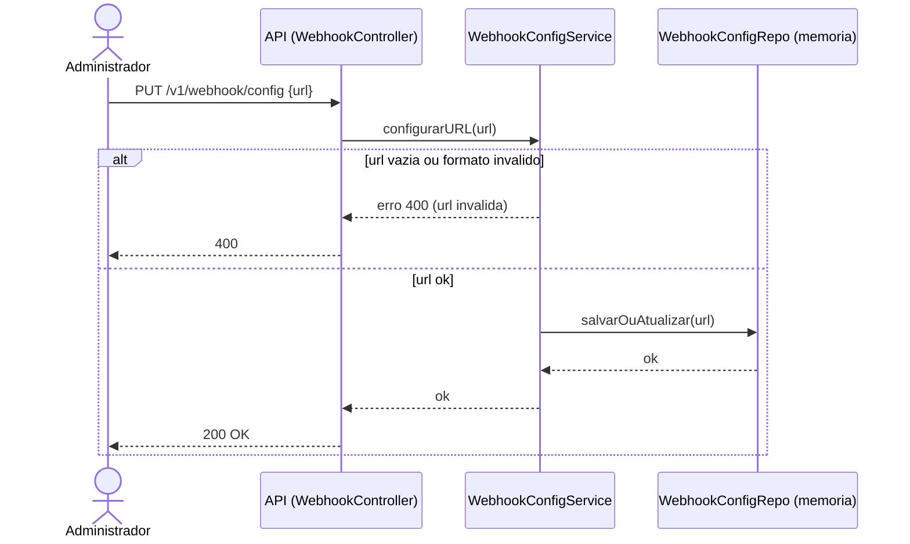
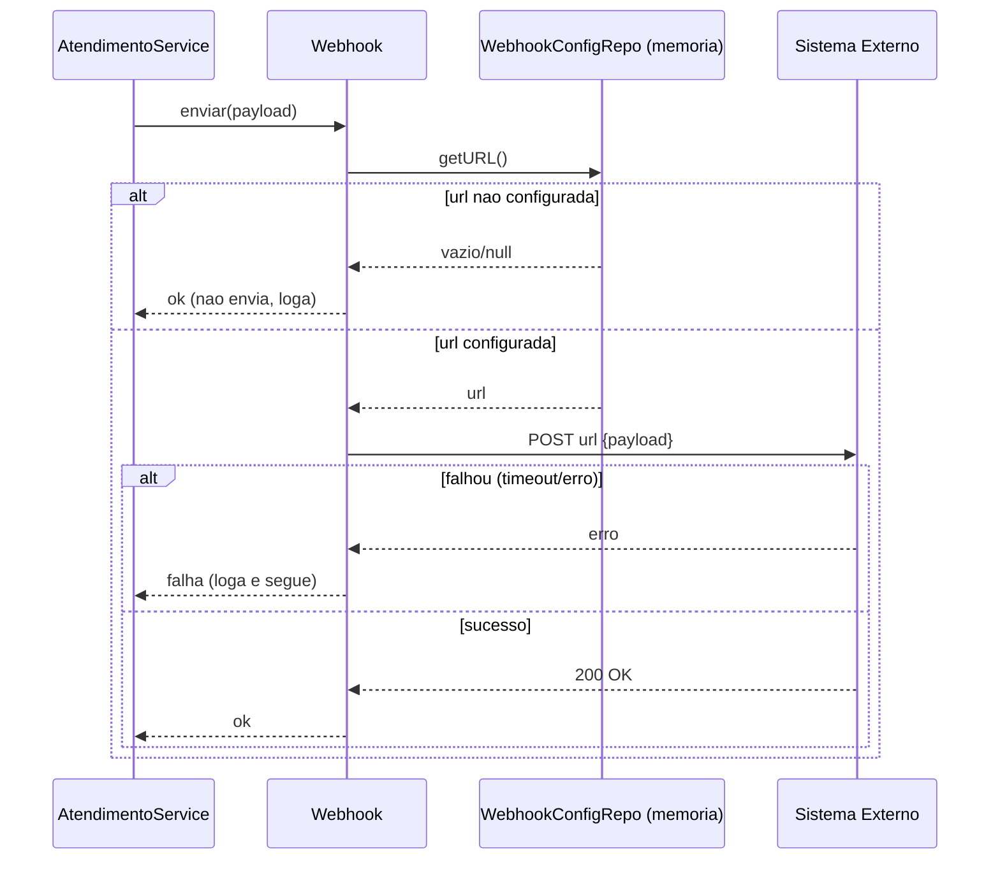

## Diagrama de sequência

draw.io: https://app.diagrams.net/#G1UR5ViAbHcCuxr4jYljAVzmnJzwghlo9q#%7B%22pageId%22%3A%22ZbWJfetMCKG_KI7-XJCB%22%7D

### Diagrama de sequência - Chamar proximo Cliente()

### O que este diagrama mostra

A sequência completa de mensagens entre **ator → API → camada de aplicação → entidades → webhook**, incluindo os principais pontos de decisão.

### Participantes e papel

- **Ator**: dispara a ação.
- **API/Controller**: valida request básica e delega.
- **AtendimentoService**: coordena o fluxo (orquestra as chamadas).
- **Servico/Fila**: aplicam regras de domínio (buscar profissional, status, escolher ficha).
- **Webhook/WebhookConfig**: tenta notificar sistema externo.

### Entrada e saída

- **Entrada mínima**: `idServico`, `idProfissional`
- **Saída de sucesso**: dados do atendimento criado
- **Erros que interrompem o fluxo**: serviço inexistente, profissional inválido/não autorizado, profissional não disponível, fila vazia, falha ao criar atendimento
- **Erros que não interrompem**: falha no webhook / URL não configurada (apenas log)

### Pontos de decisão (alts)

1. Serviço existe?
2. Profissional pertence ao serviço?
3. Profissional está DISPONIVEL?
4. Fila tem ficha?
5. Webhook tem URL configurada?
6. Chamada do webhook foi bem sucedida?

### Decisões de modelagem

- O webhook é **best-effort**: falhar webhook não deve bloquear o atendimento.
- A escolha da ficha acontece **dentro da Fila** (Priority → Medium → Low).
- Controle de concorrência é responsabilidade da implementação.

### Diagrama de sequência - Encerrar Atendimento()

### O que este diagrama mostra

O encerramento de um atendimento em andamento, registrando `fimEm` e liberando o profissional (`DISPONIVEL`), com validações principais usando `alt`.

### Participantes e papel

- **Ator**: solicita encerramento.
- **API/Controller**: recebe e delega.
- **AtendimentoService**: coordena validações e atualização.
- **Servico**: valida vínculo e status do profissional.
- **AtendimentoRepo**: localiza e atualiza o atendimento em aberto.

### Entrada e saída

- **Entrada mínima**: `idServico`, `idProfissional`
- **Saída de sucesso**: confirmação (200 OK) e/ou atendimento atualizado
- **Erros que interrompem**: serviço inexistente, profissional não autorizado, profissional não OCUPADO, atendimento em aberto não encontrado, erro interno

### Pontos de decisão (alts)

1. Serviço existe?
2. Profissional pertence ao serviço?
3. Profissional está OCUPADO?
4. Existe atendimento em aberto para encerrar?

### Decisões de modelagem

- Encerrar atendimento não consulta fila.
- Se status for OCUPADO mas não existir atendimento em aberto, isso é tratado como inconsistência (erro + log).

### Diagrama de sequência - Emitir Ficha()

#### O que este diagrama mostra

A emissão de uma ficha por um cliente, com validação de entrada e inclusão da ficha na fila correta (Priority/Medium/Low).

#### Participantes e papel

- **Ator**: solicita emissão.
- **API/Controller**: recebe requisição e delega.
- **FichaService**: coordena validações e criação da ficha.
- **ServicoRepo/Servico**: garante que o serviço existe e gera a ficha.
- **Fila**: recebe a ficha na fila correspondente.

#### Entrada e saída

- **Entrada mínima**: `idServico`, `nomeCliente`, `categoria`
- **Saída de sucesso**: ficha criada (ex.: `201`)
- **Erros que interrompem**: nome inválido, categoria inválida, serviço inexistente, erro interno ao manipular fila/memória

#### Pontos de decisão (alts)

1. Nome do cliente é válido?
2. Categoria é válida?
3. Serviço existe?

#### Decisões de modelagem

- A ficha pode ser emitida mesmo que não exista profissional disponível (pode retornar aviso informativo).
- A escolha da fila (Priority/Medium/Low) é responsabilidade da `Fila.adicionarFicha()`.

### Diagrama de sequência - Listar Serviços()

#### O que este diagrama mostra

A leitura da lista de serviços cadastrados em memória e o retorno para o ator.

#### Participantes e papel

- **Ator**: solicita listagem.
- **API/Controller**: recebe requisição e delega.
- **ServicoService**: coordena a busca.
- **ServicoRepo**: retorna a lista em memória.

#### Entrada e saída

- **Entrada mínima**: nenhuma
- **Saída de sucesso**: lista de serviços (`200`) — pode ser vazia
- **Erros que interrompem**: erro interno ao recuperar dados / timeout

#### Pontos de decisão (alts)

1. Falha interna ao recuperar lista?

### Diagrama de sequência - Criar Serviço()

#### O que este diagrama mostra

A criação de um novo serviço com validação do nome e verificação de duplicidade, persistindo em memória.

#### Participantes e papel

- **Ator**: solicita criação.
- **API/Controller**: recebe requisição e delega.
- **ServicoService**: valida e coordena.
- **ServicoRepo**: checa duplicidade e salva o novo serviço.

#### Entrada e saída

- **Entrada mínima**: `nome`
- **Saída de sucesso**: serviço criado (`201`)
- **Erros que interrompem**: nome inválido, serviço duplicado, erro interno ao salvar

#### Pontos de decisão (alts)

1. Nome é válido?
2. Serviço já existe?

### Diagrama de sequência - Configurar Webhook()

#### O que este diagrama mostra

A atualização da URL de webhook utilizada pelo sistema para envio de notificações.

#### Participantes e papel

- **Ator**: solicita configuração.
- **API/Controller**: recebe requisição e delega.
- **WebhookConfigService**: valida e coordena.
- **WebhookConfigRepo**: salva/atualiza a URL em memória.

#### Entrada e saída

- **Entrada mínima**: `url`
- **Saída de sucesso**: confirmação (`200`)
- **Erros que interrompem**: url inválida, erro interno ao salvar

#### Pontos de decisão (alts)

1. URL é válida?

### Diagrama de sequência - Enviar Webhook()

#### O que este diagrama mostra

O envio de webhook como ação interna: busca de URL configurada e tentativa de POST, registrando falhas sem quebrar o fluxo chamador.

#### Participantes e papel

- **Caller**: componente que solicita o envio (ex.: caso de uso).
- **Webhook**: prepara e tenta enviar.
- **WebhookConfigRepo**: fornece a URL configurada.
- **Sistema Externo**: recebe a requisição (quando possível).

#### Entrada e saída

- **Entrada mínima**: `payload`
- **Saída**: resultado da tentativa (ok/falha) + logs
- **Erros que não interrompem**: url não configurada, falha de rede/timeout, resposta inválida

#### Pontos de decisão (alts)

1. URL está configurada?
2. POST foi bem sucedido?

#### Decisões de modelagem

- Webhook é best-effort: falhas não devem quebrar o fluxo principal chamador.

