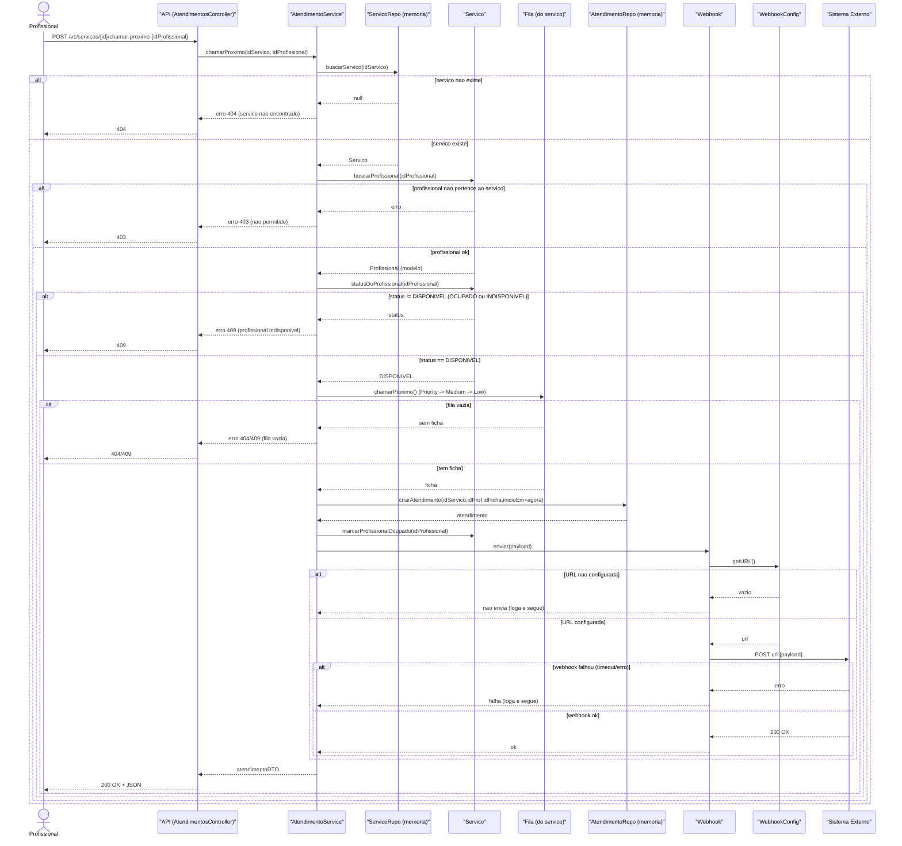

## Diagrama de sequencia

draw.io: https://app.diagrams.net/#G1UR5ViAbHcCuxr4jYljAVzmnJzwghlo9q#%7B%22pageId%22%3A%22ZbWJfetMCKG_KI7-XJCB%22%7D

```mermaid
sequenceDiagram
    actor Prof as Profissional
    participant API as "API (AtendimentosController)"
    participant SVC as "AtendimentoService"
    participant Repo as "ServicoRepo (memoria)"
    participant Serv as "Servico"
    participant Fila as "Fila (do servico)"
    participant ARepo as "AtendimentoRepo (memoria)"
    participant WH as "Webhook"
    participant WHC as "WebhookConfig"
    participant Ext as "Sistema Externo"

    Prof->>API: POST /v1/servicos/{id}/chamar-proximo {idProfissional}
    API->>SVC: chamarProximo(idServico, idProfissional)

    SVC->>Repo: buscarServico(idServico)
    alt servico nao existe
        Repo-->>SVC: null
        SVC-->>API: erro 404 (servico nao encontrado)
        API-->>Prof: 404
    else servico existe
        Repo-->>SVC: Servico

        SVC->>Serv: buscarProfissional(idProfissional)
        alt profissional nao pertence ao servico
            Serv-->>SVC: erro
            SVC-->>API: erro 403 (nao permitido)
            API-->>Prof: 403
        else profissional ok
            Serv-->>SVC: Profissional (modelo)

            SVC->>Serv: statusDoProfissional(idProfissional)
            alt status != DISPONIVEL (OCUPADO ou INDISPONIVEL)
                Serv-->>SVC: status
                SVC-->>API: erro 409 (profissional indisponivel)
                API-->>Prof: 409
            else status == DISPONIVEL
                Serv-->>SVC: DISPONIVEL

                SVC->>Fila: chamarProximo() (Priority -> Medium -> Low)
                alt fila vazia
                    Fila-->>SVC: sem ficha
                    SVC-->>API: erro 404/409 (fila vazia)
                    API-->>Prof: 404/409
                else tem ficha
                    Fila-->>SVC: ficha

                    SVC->>ARepo: criarAtendimento(idServico,idProf,idFicha,inicioEm=agora)
                    ARepo-->>SVC: atendimento

                    SVC->>Serv: marcarProfissionalOcupado(idProfissional)

                    SVC->>WH: enviar(payload)
                    WH->>WHC: getURL()

                    alt URL nao configurada
                        WHC-->>WH: vazio
                        WH-->>SVC: nao envia (loga e segue)
                    else URL configurada
                        WHC-->>WH: url
                        WH->>Ext: POST url {payload}
                        alt webhook falhou (timeout/erro)
                            Ext-->>WH: erro
                            WH-->>SVC: falha (loga e segue)
                        else webhook ok
                            Ext-->>WH: 200 OK
                            WH-->>SVC: ok
                        end
                    end

                    SVC-->>API: atendimentoDTO
                    API-->>Prof: 200 OK + JSON
                end
            end
        end
    end
```
