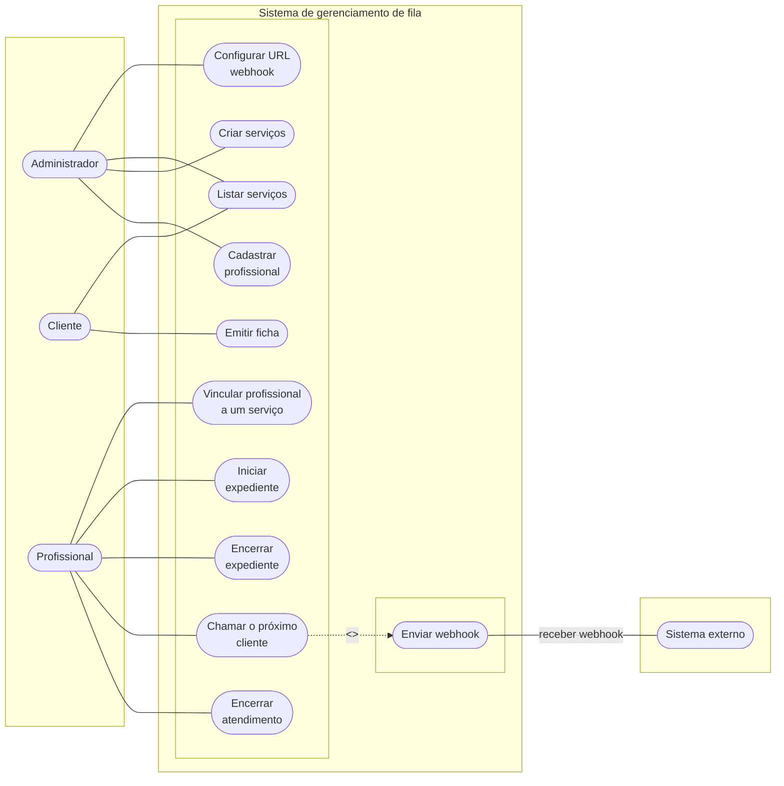

## Caso de uso

draw.io: https://app.diagrams.net/#G1UR5ViAbHcCuxr4jYljAVzmnJzwghlo9q#%7B%22pageId%22%3A%227V9Oo_qkh-ZA_1hTpyhE%22%7D



## Listar Serviços

Ator: Administrador/cliente
Objetivo: Retornar todos os serviços cadastrados.

Pré-condição: Nenhuma.

Fluxo Principal:

1.  O ator solicita a listagem dos serviços.
2.  O sistema recupera todos os serviços da memória.
3.  O sistema retorna a lista.

Exceções:

- Não ha serviços disponivel: retornar lista vazia
- Erro de comunicação/requisição inválida: retorna erro.
- Falha interna ao recuperar serviços: o sistema retorna erro e loga.
- tempo de resposta alta: o sistema retorna timeout e loga.

---

## Criar Serviço

Ator: Administrador
Objetivo: Cadastrar um novo serviço que poderá ser atendido pelos profissionais.

Pré-condição:

- O nome do serviço deve ser informado.

Fluxo Principal:

1.  O usuário solicita a criação de um novo serviço.
2.  O sistema valida se o nome do serviço foi informado.
3.  O sistema cria o serviço na memória.
4.  O sistema retorna o serviço criado com seu ID.

Exceções:

- Nome não informado: O sistema rejeita a operação e retorna erro.
- Nome invalido(vazio, com espaços): o sistema retorna erro "nome invalido".
- serviço existente: o sistema deve identificar caso haja um serviço duplicado e informar e retornar o problema.
- Falha interna ao criar o serviço: o sistema retorna erro generico e registra o log.

---

## Cadastrar Profissional

Ator: Administrador
Objetivo: Cadastrar um profissional no sistema.

Pré-condição:

- O Nome, email e senha devem ser informados.

Fluxo Principal:

1. O administrador solicita o cadastro do profissional (nome, email, senha).
2. sistema valida unicidade do email
3. sistema gera password_hash
4. O sistema cria o profissional na memória:

- gera id
- inicia sem serviço vinculado (ex.: service_id = null)

5. O sistema retorna o profissional criado.

Exceções:

- Nome não informado: retorna erro.
- Email já cadastrado: retorna erro.
- Profissional duplicado (se você quiser regra por nome): retorna erro.
- Falha interna ao criar: retorna erro e loga.

---

## Vincular Profissional a um Serviço

Ator: Profissional
Objetivo: Selecionar o serviço em que irá atuar.

Pré-condições:

- O profissional deve existir.
- O serviço deve existir.
- O serviço informado deve possuir id válido (não vazio/branco).
- O profissional deve estar UNAVAILABLE
- profissional não pode estar BUSY ou AVAILABLE

Fluxo Principal:

1. O profissional solicita vincular-se a um serviço.
2. O sistema valida se o profissional existe.
3. O sistema valida se o serviço existe.
4. O sistema valida que o id do serviço foi informado corretamente.
5. O sistema valida que o profissional está UNAVAILABLE.
6. O sistema registra o vínculo (profissional.service_id = serviço.id).
7. O sistema confirma a operação.

Exceções:

- Serviço inexistente: retorna erro.
- Profissional inexistente: retorna erro.
- service_id vazio/branco: retorna erro (requisição inválida).
- Profissional BUSY: retorna erro (não pode trocar de serviço em atendimento).
- Falha interna ao alterar vínculo: retorna erro e loga.
- Profissional BUSY OU AVAILABLE: retorna erro

---

## Iniciar Expediente

Ator: Profissional
Objetivo: Informar que está disponível para atender em um serviço.

Pré-condições:

- O serviço deve existir.
- O profissional deve estar vinculado ao serviço.
- O profissional não pode estar BUSY.

Fluxo Principal:

1. O profissional solicita iniciar expediente.
2. O sistema valida se o serviço existe.
3. O sistema valida se o profissional pertence ao serviço.
4. O sistema valida se o profissional não está BUSY.
5. O sistema altera o status do profissional para AVAILABLE.
6. O sistema cria registro de atuação profissional (professional_id, service_id, started_at)
6. O sistema confirma a operação.

Exceções:

- Serviço inexistente: retorna erro.
- Já existe expediente ativo para o profissional.
- Profissional não vinculado ao serviço: bloqueia/retorna erro.
- Profissional está BUSY: retorna erro (“encerre o atendimento antes de iniciar expediente”).
- Erro interno ao alterar o estado: registra log e retorna erro.

---

## Encerrar Expediente

Ator: Profissional
Objetivo: Informar que não está mais disponível para atender.

Pré-condições:

- O serviço deve existir.
- O profissional deve estar vinculado ao serviço.
- O profissional não pode estar BUSY.
- O profissional deve estar AVAILABLE. 

Fluxo Principal:

1.  O profissional solicita encerrar expediente.
2.  O sistema valida se o serviço existe.
3.  O sistema valida se o profissional pertence ao serviço.
4.  O sistema valida se o profissional não está BUSY.
5.  O sistema altera o status do profissional para UNAVAILABLE.
6.  O sistema finaliza o registro de atuação aberto (ended_at)
7.  O sistema remove vínculo com serviço (service_id = null)
6.  O sistema confirma a operação.

Exceções:

- Serviço inexistente: retorna erro.
- Profissional não vinculado ao serviço: bloqueia/retorna erro.
- Profissional está BUSY: retorna erro (“encerre o atendimento antes de encerrar expediente”).
- Se existir ficha na fila → bloquear.
- Erro interno ao alterar o estado: registra log e retorna erro.

---

## Encerrar Atendimento

Ator: Profissional
Objetivo: Encerrar o atendimento em andamento e liberar o profissional

Pré-condição:

- O serviço deve existir.
- O profissional deve estar vinculado ao serviço informado.
- O profissional deve estar com status BUSY.

Fluxo Principal:

1. O profissional solicita encerrar o atendimento atual.
2. O sistema valida se o serviço existe.
3. O sistema valida se o profissional pertence ao serviço.
4. O sistema valida se o profissional está BUSY.
5. O sistema registra o fim do atendimento atual.
6. O sistema altera o status do profissional para AVAILABLE.
7. O sistema confirma a operação.

Exceções:

- Serviço inexistente: o sistema retorna erro.
- Profissional não vinculado ao serviço: o sistema bloqueia a operação.
- Profissional não está BUSY: o sistema retorna erro.
- Profissional tentando encerrar atendimento de outro profissional (ID incorreto enviado): o sistema rejeita a operação.
- Erro interno ao alterar o estado: o sistema registra log e retorna erro.

---

## Emitir Ficha

Ator: Cliente
Objetivo: Gerar uma ficha de atendimento com prioridade.

Pré-condições:

- O serviço deve existir.
- A categoria deve ser válida (Priority, Medium, Low).
- O nome do cliente deve ser informado.

Fluxo Principal:

1.  O cliente solicita a emissão da ficha informando:
    – nome do cliente
    – serviço
    – categoria
2.  O sistema valida os dados.
3.  O sistema gera uma nova ficha com ID único por serviço.
4.  O sistema registra o momento de emissão.
5.  O sistema adiciona a ficha na fila correta do serviço.
6.  O sistema retorna a ficha emitida.

Exceções:

- Nome do cliente não informado: o sistema retorna erro.
- Categoria inválida: O sistema retorna erro.
- Serviço inexistente: O sistema retorna erro.
- Serviço existe mas não há profissional AVAILABLE: O sistema emite a ficha normalmente e pode retornar um aviso informativo.
- Fila do serviço corrompida(erro na memoria):o sistema registra o erro e loga.

---

## Chamar Próximo Cliente

Ator: Profissional
Objetivo: Chama o próximo cliente da fila, respeitando prioridade e ordem.

Pré-condições:

- O serviço deve existir.
- O profissional deve estar vinculado ao serviço existente.
- O profissional deve estar com status AVAILABLE.
- Deve existir cliente na fila.

Fluxo Principal:

1.  O profissional solicita chamar o próximo cliente.
2.  O sistema valida se o serviço existe.
3.  O sistema valida se o profissional pertence ao serviço.
4.  O sistema valida se o profissional está AVAILABLE.
5.  O sistema valida que a fila não está vazia.
6.  O sistema seleciona a próxima ficha (Priority → Medium → Low + FIFO).
7.  O sistema cria um Atendimento (inicioEm e associações).
8.  O sistema muda status do profissional para BUSY.
9.  O sistema envia o webhook.
10. O sistema retorna os dados do atendimento.

Exceções:

- Serviço inexistente: retorna erro.
- Profissional não pertence ao serviço: retorna erro/bloqueia.
- Profissional UNAVAILABLE: retorna erro.
- Profissional BUSY: retorna erro (precisa encerrar antes).
- Fila vazia: retorna erro.
- Falha ao criar atendimento: retorna erro e loga.
- Webhook falhou: loga e prossegue.
- URL webhook não configurada: loga e prossegue.
- Concorrência (2 profissionais ao mesmo tempo): garantir controle.

---

## Enviar Webhook

Ator: Sistema interno
Objetivo: Enviar os dados da chamada para um endpoint configurado.

Pré-condição: nenhuma

Fluxo Principal:

1.  Quando um cliente é chamado, o sistema prepara o payload do webhook.
2.  O sistema envia uma requisição HTTP para o endpoint configurado.
3.  O sistema registra que tentou disparar o webhook.

Exceções:

- Endpoint fora do ar: O sistema registra o erro no log.
- Endpoint recusou: o sistema registra erro.
- URL do webhook não configurada: o sistema registra erro e não envia nada.
- Payload invalido: o sistema registra erro.
- falha na rede: o sistema registra erro.
- a resposta do endpoint demorou demais: o sistema registra timeout e loga.

---

## Configurar URL do Webhook

Ator: Administrador
Objetivo: Configurar o endpoint para onde os webhooks serão enviados.

Fluxo principal:

1.  O administrador acessa a configuração do sistema.
2.  O administrador informa a URL do webhook.
3.  O sistema valida o formato da URL.
4.  O sistema salva a configuração.

```

```
